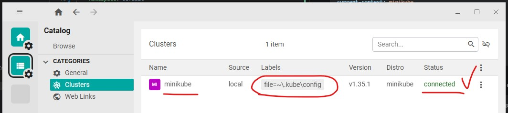
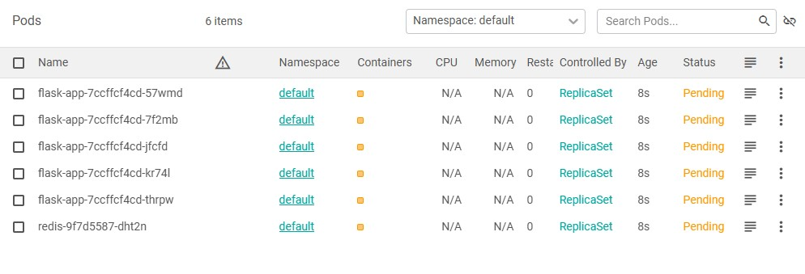
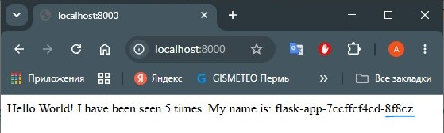
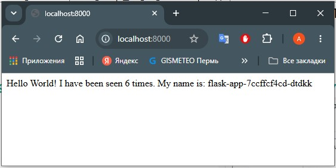

# Лаб. 7 Kubernetes - basics

## 0. Подготавливаем и разворачиваем кластер kubernetes в minikube  

### 0.1. Установка
```bash
$ curl -LO "https://dl.k8s.io/release/$(curl -L -s https://dl.k8s.io/release/stable.txt)/bin/linux/amd64/kubectl"
$ sudo install -o root -g root -m 0755 kubectl /usr/local/bin/kubectl
$ curl -LO https://storage.googleapis.com/minikube/releases/latest/minikube_latest_amd64.deb
$ sudo dpkg -i minikube_latest_amd64.deb
$ sudo swapoff -a
$ minikube start --vm-driver=docker
```
здесь:
- подразумевается, что для текущего пользователя уже есть права на запуск docker (пользователь включен в группу docker)
- устанавливаем kubectl
- скачиваем и устанавливаем minikube
- отключаем swap
- запускаем minikube в режиме однонодового кластера

### 0.2. Проверка  
Проверяем minikube:  
```bash
$ minikube status
minikube
type: Control Plane
host: Running
kubelet: Running
apiserver: Running
kubeconfig: Configured
```
Проверяем kubectl:  
```bash
$ kubectl get nodes
NAME       STATUS   ROLES           AGE   VERSION
minikube   Ready    control-plane   5h    v1.35.1
$ kubectl get services
NAME             TYPE           CLUSTER-IP       EXTERNAL-IP           PORT(S)          AGE
kubernetes       ClusterIP      10.96.0.1        <none>                443/TCP          5h2m
```
### 0.3. Настройка FreeLens (аналог Lens)  
из Windows-хоста в powershell выполняем:  
```powershell
scp -P 2222 sysadmin@127.0.0.1:/home/sysadmin/.kube/config C:\tmp\k8s
scp -P 2222 sysadmin@127.0.0.1:/home/sysadmin/.minikube/profiles/minikube/client.crt C:\tmp\k8s
scp -P 2222 sysadmin@127.0.0.1:/home/sysadmin/.minikube/profiles/minikube/client.key C:\tmp\k8s
scp -P 2222 sysadmin@127.0.0.1:/home/sysadmin/.minikube/ca.crt C:\tmp\k8s
```
Копируем файлы в домашнюю папку в путь `~\.kube`  
Обновляем пути к файлам - указываем абсолютные пути:  
```yml
apiVersion: v1
clusters:
- cluster:
    # здесь:
    certificate-authority: C:\Users\andr0\.kube\ca.crt
    extensions:
    - extension:
        last-update: Wed, 24 Jun 2026 11:52:25 UTC
        provider: minikube.sigs.k8s.io
        version: v1.38.1
      name: cluster_info
    # указываем адрес localhost для Windows-хоста, порт 8443
    server: https://127.0.0.1:8443
  name: minikube
contexts:
- context:
    cluster: minikube
    extensions:
    - extension:
        last-update: Wed, 24 Jun 2026 11:52:25 UTC
        provider: minikube.sigs.k8s.io
        version: v1.38.1
      name: context_info
    namespace: default
    user: minikube
  name: minikube
current-context: minikube
kind: Config
users:
- name: minikube
  user:
    # здесь две строки:
    client-certificate: C:\Users\andr0\.kube\client.crt
    client-key: C:\Users\andr0\.kube\client.key
```
Пробрасываем порт на Windows-хосте: 127.0.0.1 -> 8443:8443  
Внутри ВМ добавляем правило в таблицу маршрутизации для связи с k8s:  
```bash
$ sudo iptables -t nat -A PREROUTING -d 10.0.2.15 -p tcp --dport 8443 -j DNAT --to 192.168.49.2:8443
```
Скачиваем и устанавливаем Freelens:  
https://github.com/freelensapp/freelens/releases/download/v1.10.1/Freelens-1.10.1-windows-amd64.exe  
После запуска FreeLens автоматически обнаружит настройки в папке `~/.kube` и присоединится к кластеру.
  
## 1. Подготавливаем и разворачиваем приложение flask+redis

### 1.1. В качестве исходников берем приложение из предыщущей лабораторной
Изменяем приложение, чтобы оно отображало не только количество посещений страницы, но и имя хоста:  
```python
import redis
import time
# импортируем новую библиотеку
import socket
from flask import Flask

app = Flask(__name__)
cache = redis.Redis(host='redis', port=6379)

# изменяем функцию:
def get_hit_count():
    retires = 5
    while True:
          try:
               return cache.incr('hits')
          except redis.exceptions.ConnectionError as exc:
               if retries == 0:
                    raise exc
               retries -= 1
               time.sleep(0.5)

@app.route('/')
def hello():
    count = get_hit_count()
    # изменяем эту строку: 
    return 'Hello World! I have been seen {} times. My name is: {}\n'.format(count, socket.gethostname())
```  
Пушим на github и забираем в виртуалку `git push` из windows, `git pull` из ВМ
### 1.2. Передаем образы в minikube   
```bash
$ minikube image build -t flask:v1 flask_redis/
$ minikube image load redis:alpine  
$ minikube image ls
```
здесь:
- собираем образ flask в minikube и присваиваем имя `flask:v1`
- загружаем образ redis в minikube
- проверяем что образы успешно собрались и загрузились:  
```bash
$ minikube image ls
...
docker.io/library/redis:alpine
docker.io/library/flask:v1
```
### 1.3. Готовим манифесты для каждого из сервисов  
создаем в корне репозитория папку `flask_redis_k8s`, добавляем файлы:  
- манифест приложения flask: вид нагрузки `Deployment`, имя пода `flask-app`, с количеством реплик 5, используемый образ `flask:v1`:  
```yml
apiVersion: apps/v1
kind: Deployment
metadata:
  name: flask-app
  labels:
    app: flask-app
spec:
  replicas: 5
  selector:
    matchLabels:
      app: flask-app
      svc: front
  template:
    metadata:
      labels:
        app: flask-app
        svc: front
    spec:
      containers:
        - name: flask
          image: flask:v1
          imagePullPolicy: IfNotPresent
          ports:
          - containerPort: 5000
          resources:
            limits:
              memory: "256Mi"
```
- манифест базы данных redis: вид нагрузки `Deployment`, имя пода `redis`, с количеством реплик 1, из образа `redis:alpine`
```yml
apiVersion: apps/v1
kind: Deployment
metadata:
  name: redis
  labels:
    app: flask-app
spec:
  replicas: 1
  selector:
    matchLabels:
      app: flask-app
  template:
    metadata:
      labels:
        app: flask-app
        svc: db
    spec:
      containers:
        - name: redis
          image: redis:alpine
          imagePullPolicy: IfNotPresent
          ports:
            - containerPort: 6379
```
- манифест сервиса flask-service: вид нагрузки `Service`, тип сервиса `LoadBalancer`, меткой `app: flask-app` направляем на поды `flask-app`, внешний порт - 8000, внутренний порт для приложения flask - 5000, внешний адрес - ip адрес ВМ: 
```yml
apiVersion: v1
kind: Service
metadata:
  name: service-devops
  labels:
    app: flask-app
spec:
  type: LoadBalancer
  selector:
    app: flask-app
    svc: front
  ports:
    - port: 8000
      targetPort: 5000
  externalIPs:
    - 10.0.2.15
```
- манифест сервиса redis-service: вид нагрукзи `Service`, тип сервиса `ClusterIP`, селектором `flask-app` направляем на поды `flask-app`, внешний порт делаем таким же как внутренний бд redis - 6379, внешний ip адрес не требуется - разрешение имен по dns именам внутри кластера:  
```yml
apiVersion: v1
kind: Service
metadata:
  name: redis
  labels:
    app: flask-app
spec:
  type: ClusterIP
  selector:
    app: flask-app
    svc: db
  ports:
    - port: 6379
      targetPort: 6379
```
### 1.4. Запускаем нагрузку на кластере и проверяем   
Делаем `git push` на windows-хосте, `git pull` на ВМ  
Внутри ВМ выполняем команду `kubectl apply -f flask_redis_k8s/` - разворачиваем нагрузку на кластер,  
наблюдаем за разворачиванием подов в командной строке...  
```bash
$ kubectl apply -f flask_redis_k8s/ && kubectl get pods
service/service-devops created
deployment.apps/flask-app created
service/redis created
deployment.apps/redis created
NAME                         READY   STATUS              RESTARTS   AGE
flask-app-7ccffcf4cd-57wmd   0/1     Pending             0          1s
flask-app-7ccffcf4cd-7f2mb   0/1     Pending             0          1s
flask-app-7ccffcf4cd-jfcfd   0/1     Pending             0          1s
flask-app-7ccffcf4cd-kr74l   0/1     ContainerCreating   0          1s
flask-app-7ccffcf4cd-thrpw   0/1     ContainerCreating   0          1s
redis-9f7d5587-dht2n         0/1     Pending             0          1s
```
и в интерфейсе Freelens (не забываем выбрать `default` namespace):  
  
когда нагрузка развернута, проверяем:  
```bash
$ kubectl get pods
NAME                         READY   STATUS    RESTARTS   AGE
flask-app-7ccffcf4cd-57wmd   1/1     Running   0          5m52s
flask-app-7ccffcf4cd-7f2mb   1/1     Running   0          5m52s
flask-app-7ccffcf4cd-jfcfd   1/1     Running   0          5m52s
flask-app-7ccffcf4cd-kr74l   1/1     Running   0          5m52s
flask-app-7ccffcf4cd-thrpw   1/1     Running   0          5m52s
redis-9f7d5587-dht2n         1/1     Running   0          5m52s
$ kubectl get services
NAME             TYPE           CLUSTER-IP     EXTERNAL-IP   PORT(S)          AGE
kubernetes       ClusterIP      10.96.0.1      <none>        443/TCP          17h
redis            ClusterIP      10.99.19.128   <none>        6379/TCP         5m58s
service-devops   LoadBalancer   10.102.5.192   10.0.2.15     8000:32501/TCP   5m58s
```
> для снятия нагрузки с кластера используем команду `kubectl delete -f flask_redis_k8s/`  

Помним, что порт 8000 уже проброшен на ВМ.  
Для взаимодействия с приложениями внутри кластера выполняем  
`minikube tunnel --bind-address 10.0.2.15` - и оставляем работать.  
из Windows-хоста проверяем из браузера:  


Приложение отображает разные имена подов и увеличивающийся счетчик из redis.  

